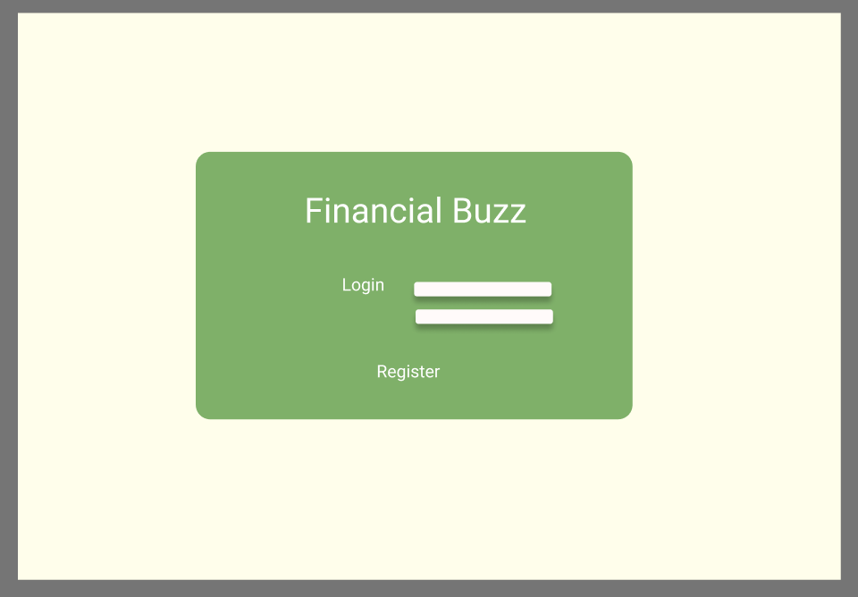
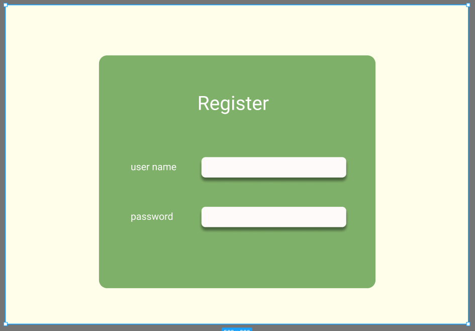
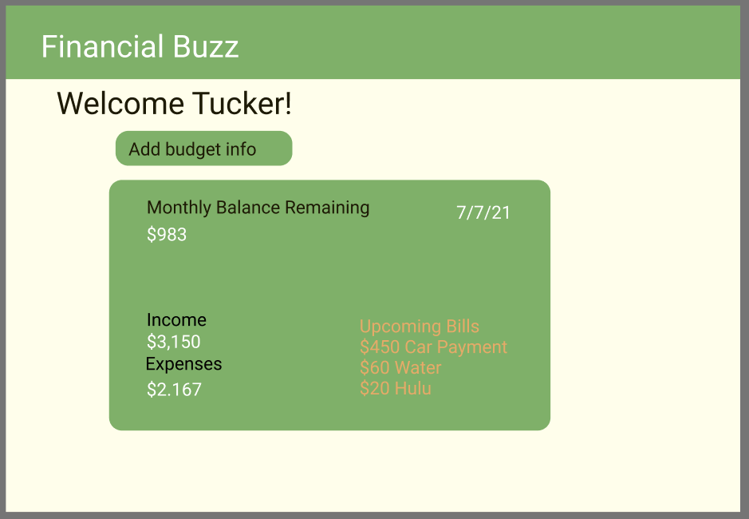
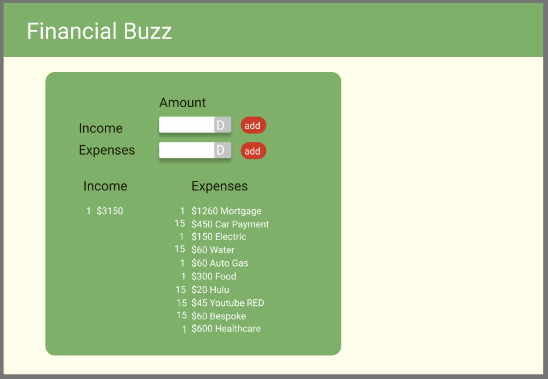

# Financial Buzz (Project 2 Proposal)

## Description
This application will enable a user to create a budget to manage their monthly expenses with ease. Using submitted income and cost information, a remaining balance will be provider to the user enabling additional future financial planning. 

## Table of contents
- [Description](#Description)
- [User Story](#Userstory)
- [New technology](#Newtechnology)
- [Visual Mockup](#VisualMockup)
- [Tasks](#Tasks)

## User Story
AS a user
I WANT to create a monthly budget.
SO THAT I can organize my expenses and know how much money I will have remaining after paying my bills.

## New technology used in the project are as follows:
Chart JS

## Visual Mockup

The following shows the application's intended user interface.

## Tasks:
The following is a rough breakdown of tasks to be completed for this project: 

- Create the following directories:

- Config (connection.js for authentication using sequelize and dotenv).

- Controllers (Route Js files (in proper nesting format).

- Db (for schema.sql file database creation).

- Models (for sequelize js files)

- Public (css file/directiory, js directory with (login and logout js files))

- Seeds 

- utils (auth and helpers js express session and cookies) ?

- views (layout directory with handlebar files)

- Create the following files:

- .env (Database, User Name and password) (Use password hashing)

- Server.js

