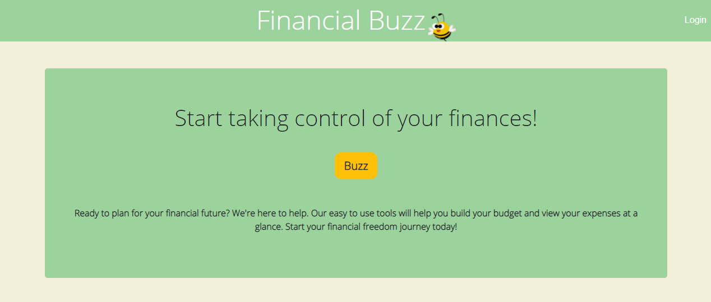

# Financial-Buzz  

## Description
This application will enable a user to create a budget to manage their monthly expenses with ease. Using submitted income and cost information, a remaining balance will be provided to the user enabling additional future financial planning.

## Table of contents
- [Description](#Description)
- [Installation](#Installation)
- [Usage](#Usage)
- [license](#license) 
- [Contributing](#Contributing)
- [Questions](#Questions)

## Installation
This application is deployed at the following link: [https://financial-buzz.herokuapp.com/](https://financial-buzz.herokuapp.com/)

## Usage

The following shows the applications landing page:

## License

This application is covered under a MIT license. 
To learn more about this license, please visit the following site: [https://choosealicense.com/licenses/mit/](https://choosealicense.com/licenses/mit/).

## Contributing
To contribute to this repo, please contact me on GITHUB or by email (Links below).

## Questions
Additional information for this application can be found on my [github](https://www.github.com/cassiep1986?tab=repositories/).

For questions, you can contact me by email at cassie1986@gmail.com by clicking [here](mailto:cassiep1986@gmail.com).